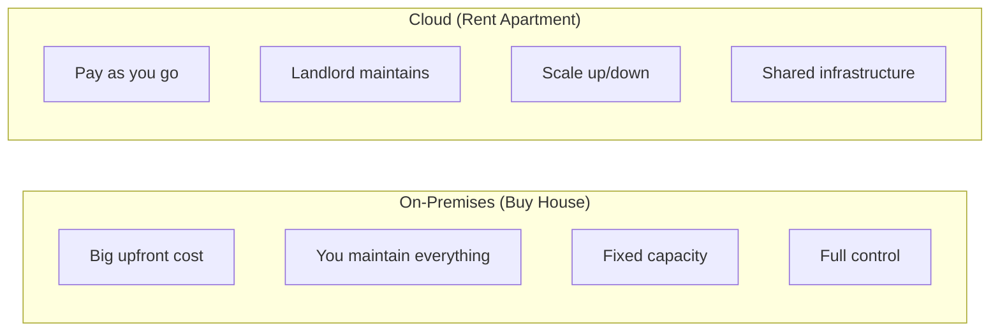
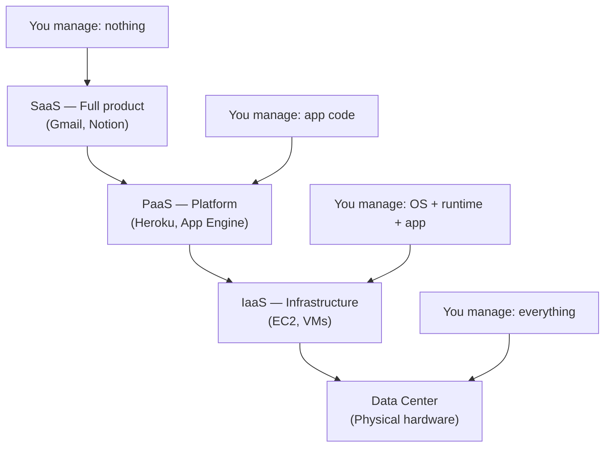

# What Is the Cloud

## Renting Computers Instead of Buying Them

On-premises: you buy servers, rack them, power them, cool them, replace broken disks, and pay for all of it whether you use it or not. Cloud: someone else handles the hardware. You rent what you need, when you need it.

**Analogy:**

| On-Premises | Cloud |
|-------------|-------|
| Buying a house | Renting an apartment |


| You fix the plumbing | Landlord fixes the plumbing |
| Pay mortgage regardless | Pay rent for what you use |
| Hard to move | Move anytime |

## Service Models

Three layers of abstraction. Each trades control for convenience:



```
+------------------+
|  SaaS            |  <- Software: Gmail, Salesforce
+------------------+
|  PaaS            |  <- Platform: Heroku, App Engine
+------------------+
|  IaaS            |  <- Infrastructure: EC2, VMs
+------------------+
|  Physical Hardware|  <- The data center floor
+------------------+
```

- **IaaS** -- You manage OS, runtime, and app. Provider manages hardware. Maximum control, maximum responsibility.
- **PaaS** -- You manage code. Provider manages runtime and below. Fastest path to deployment.
- **SaaS** -- You use the software. Provider manages everything. Zero ops, zero control.

## Why Cloud

**Pay for what you use.** Shut down test environments at 6 PM. Scale to zero when no traffic exists. A startup no longer needs $50K in server purchases before writing a single line of code.

**Scale on demand.** Black Friday traffic spike? Add 100 servers in minutes, remove them an hour later. No procurement cycle.

**Managed services.** Want a database? Click a button. Want message queues? Another button. The provider handles patching, backups, and failover.

**Global by default.** Deploy in Tokyo, Frankfurt, and Virginia simultaneously. Your users hit the nearest region.

## When Cloud Is Not the Answer

- Predictable, steady-state workloads where reserved hardware is cheaper
- Regulatory requirements mandating physical control of data
- Extremely latency-sensitive workloads where physical proximity matters beyond what edge locations provide

The cloud is a tool, not a religion. Understand the trade-offs.
