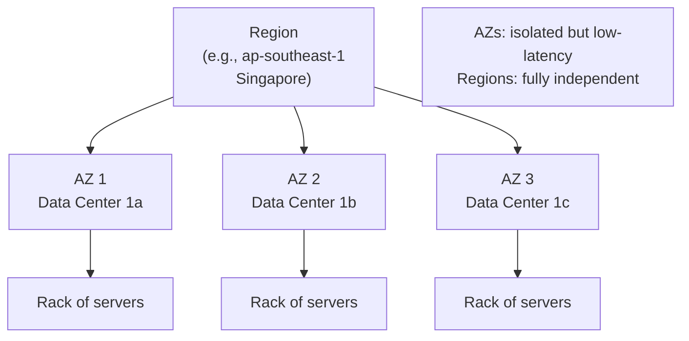

# Regions and Zones

## Geography Matters

Cloud providers operate data centers worldwide. Where you deploy affects latency, compliance, cost, and resilience.



```
Region (e.g., us-east-1)
├── Availability Zone 1 (us-east-1a)
│   └── Data center(s)
├── Availability Zone 2 (us-east-1b)
│   └── Data center(s)
└── Availability Zone 3 (us-east-1c)
    └── Data center(s)

Edge Locations (CloudFront, CDN)
└── Spread across 100+ cities globally
```

## Regions

A region is a geographic area (e.g., `us-east-1` = Virginia, `eu-west-1` = Ireland, `ap-northeast-1` = Tokyo).

**Choosing a region:**

```yaml
decision_factors:
  latency:
    question: "Where are your users?"
    rule: "Pick the region closest to them"
  compliance:
    question: "Where is data allowed to live?"
    rule: "GDPR -> EU region, HIPAA -> US region"
  cost:
    question: "What is the pricing?"
    rule: "us-east-1 is usually cheapest (most capacity)"
  service_availability:
    question: "Does this region offer the service?"
    rule: "New services launch in us-east-1 first"
```

## Availability Zones (AZs)

Each region has multiple AZs. Each AZ is one or more discrete data centers with independent power, cooling, and networking.

AZs within a region are connected with low-latency fiber (typically < 2ms between zones). They are far enough apart that a fire, flood, or power failure in one AZ does not take down another.

**Why this matters:**

Deploy your app across two AZs, and a data center can burn down without your users noticing. Deploy in one AZ, and a single failure takes you offline.

```yaml
# Good: multi-AZ deployment
database:
  primary: us-east-1a
  replica: us-east-1b
  failover: automatic

# Bad: single-AZ deployment
database:
  primary: us-east-1a
  # If 1a goes down, you go down
```

## Edge Locations

Points of presence (PoPs) for content delivery. CDN edge locations cache static assets close to users. A request from Tokyo for an image stored in Virginia can be served from a Tokyo edge location in milliseconds instead of crossing the Pacific.

Edge locations also serve DNS (Route 53, Cloud DNS) and global load balancing.

## Latency in Practice

```yaml
approximate_latencies:
  same_az: "sub-millisecond"
  same_region_different_az: "1-2ms"
  cross_region_same_continent: "20-50ms"
  cross_continent: "100-250ms"
```

## Key Takeaway

Region = geography. AZ = isolated data center within a region. Edge = global cache point. Deploy across AZs for resilience. Pick regions based on users, compliance, and cost.
