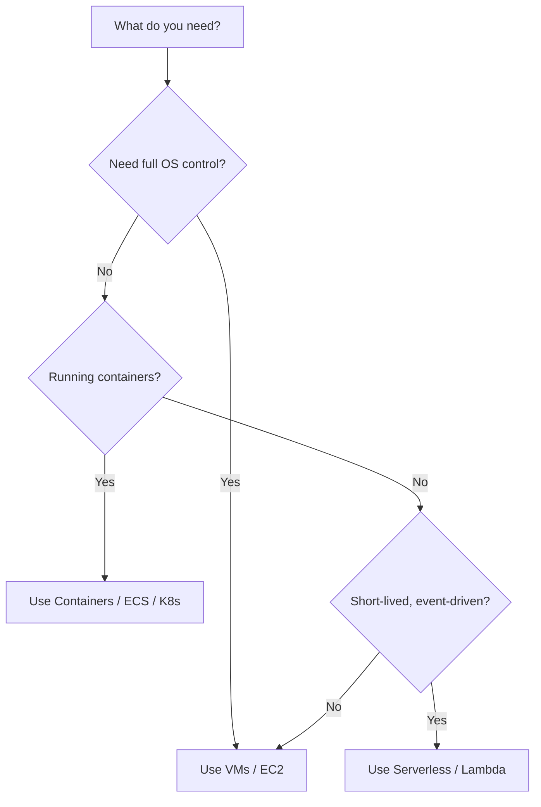

# Compute

## Three Models

```yaml
models:
  vms:
    description: "You manage the OS and runtime"
    examples: ["EC2 (AWS)", "Virtual Machines (Azure)", "Compute Engine (GCP)"]
  containers:
    description: "You manage the container, orchestrator manages placement"
    examples: ["ECS/EKS (AWS)", "AKS (Azure)", "GKE (GCP)"]
  serverless:
    description: "You manage code only"
    examples: ["Lambda (AWS)", "Azure Functions", "Cloud Functions (GCP)"]
```

## Decision Tree



```
Need to run arbitrary software or full OS control?
├── Yes → VMs
│   └── Need to run many containers at scale?
│       ├── Yes → Kubernetes (managed)
│       └── No → VMs or small container service (ECS, Cloud Run)
└── No → Short-lived, event-triggered work?
    ├── Yes → Serverless functions
    │   └── Need more than 15 min execution time?
    │       └── Yes → Containers or VMs
    └── No → Long-running service with predictable load?
        ├── Yes → Containers
        └── No → Serverless or containers
```

## Virtual Machines

You get a computer. You choose the OS, install software, open ports, and manage everything above the hypervisor.

```yaml
# Example: provisioning a VM
instance:
  type: "t3.medium"          # 2 vCPU, 4 GB RAM
  os: "ubuntu-22.04"
  disk: 50                   # GB SSD
  network: "private-subnet"
  tags:
    env: production
    team: backend
```

When VMs: legacy applications, Windows workloads, GPU computing, full OS control needed, licensed software requiring specific OS.

## Containers

Package your app with its dependencies into an immutable image. The image runs the same way on every machine.

```yaml
# Container mental model
image:
  base: "python:3.11-slim"
  app_code: "/app"
  dependencies: "requirements.txt"
  port: 8080
  command: "python server.py"
```

An orchestrator (Kubernetes, ECS) decides which machine runs which container, restarts failed containers, and scales based on load.

When containers: microservices, CI/CD pipelines, need fast scaling, want reproducible deployments, team is comfortable with Docker.

## Serverless

Write a function. It runs when triggered. You pay per invocation. No servers to manage.

```yaml
# Pseudocode: serverless function
function process_order(event):
    order = parse(event.body)
    validate(order)
    save_to_database(order)
    notify_warehouse(order)
    return { status: 200 }
```

Constraints: execution time limits (typically 15 minutes), memory limits, cold start latency, limited local storage.

When serverless: event processing (file uploads, queue messages), API backends with variable traffic, scheduled tasks, gluing services together.

When NOT serverless: long-running processes, WebSocket connections, predictable high-throughput workloads (reserved capacity is cheaper), workloads requiring local GPU.

## Cost Comparison (Relative)

```yaml
cost_for steady_load:
  vms: "$$"
  containers: "$$"
  serverless: "$$$$"   # Per-invocation pricing adds up

cost_for sporadic_load:
  vms: "$$$$"   # You pay 24/7 even when idle
  containers: "$$$"
  serverless: "$"     # Pay only when invoked
```

Right-sizing compute is an ongoing task, not a one-time decision. Start with the simplest model that fits, then optimize.
