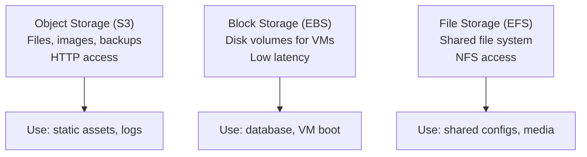

# Storage

## Three Types



| Type | Access Pattern | Examples | Think of It As |
|------|---------------|----------|----------------|
| Object | Store/retrieve files via API | S3, Blob Storage, GCS | Filing cabinet |
| Block | Mount as a disk to a VM | EBS, Managed Disk, Persistent Disk | Hard drive |
| File | Mount as shared filesystem | EFS, Azure Files, Filestore | Network drive |

## Object Storage

Store files (objects) in buckets. Access via HTTP API. Virtually unlimited capacity. 11 nines durability.

```yaml
# Typical object storage usage
bucket:
  name: "my-app-uploads"
  objects:
    - key: "images/photo.jpg"
      size: "2.4 MB"
      content_type: "image/jpeg"
    - key: "reports/2024-q1.pdf"
      size: "1.1 MB"
      content_type: "application/pdf"

  lifecycle_rules:
    - transition_to_cold_storage_after: 90   # days
    - delete_after: 365                       # days

  versioning: enabled
  encryption: "AES-256 (server-side)"
  public_access: blocked
```

**When object storage:** user uploads, static website hosting, log archival, data lake storage, backups, serving images/videos.

**Not for:** databases, block-level operations, workloads requiring POSIX filesystem semantics.

## Block Storage

Disks attached to VMs. Low latency. The VM sees it as `/dev/sdb` or `C:\`.

```yaml
# Block storage attached to a VM
volume:
  type: "SSD"
  size: 100              # GB
  iops: 3000             # input/output ops per second
  attached_to: "web-server-01"
  encryption: enabled
  snapshot_schedule: "daily at 02:00 UTC"
```

**When block storage:** VM boot disks, databases requiring low-latency disk I/O, applications needing POSIX filesystem.

**Not for:** sharing files between multiple VMs (use file storage), storing large amounts of rarely-accessed data (use object storage).

## File Storage

Shared filesystem accessible by multiple VMs simultaneously. NFS/SMB protocol.

```yaml
# Shared file system
file_system:
  protocol: "NFSv4"
  size: "auto-scaling"     # grows/shrinks with usage
  mount_target: "10.0.1.50:/mnt/shared"
  concurrent_connections: 1000
  performance_mode: "general_purpose"
```

**When file storage:** shared config files across VMs, content management systems, CI/CD workspace, lift-and-shift of on-prem apps expecting a shared drive.

## CDN on Top

A Content Delivery Network caches your content at edge locations worldwide. Users get content from the nearest edge, not your origin server.

```yaml
cdn:
  origin: "my-bucket.s3.amazonaws.com"
  edge_locations: "global (400+ points of presence)"
  cache_behavior:
    ttl: 86400              # 24 hours
    query_strings: "ignore"
  routes:
    - path: "/images/*"
      cache: true
    - path: "/api/*"
      cache: false
```

**When CDN:** static assets (images, CSS, JS), video streaming, large file downloads, reducing origin load.

## Decision Framework

```
Need to share files between VMs?
├── Yes → File storage
└── No → Accessing via HTTP/API?
    ├── Yes → Object storage + CDN for public content
    └── No → Need low-latency block I/O?
        ├── Yes → Block storage
        └── No → Object storage (default choice)
```

Object storage is the right answer 80% of the time. It is the default. Reach for block or file only when the use case demands it.
