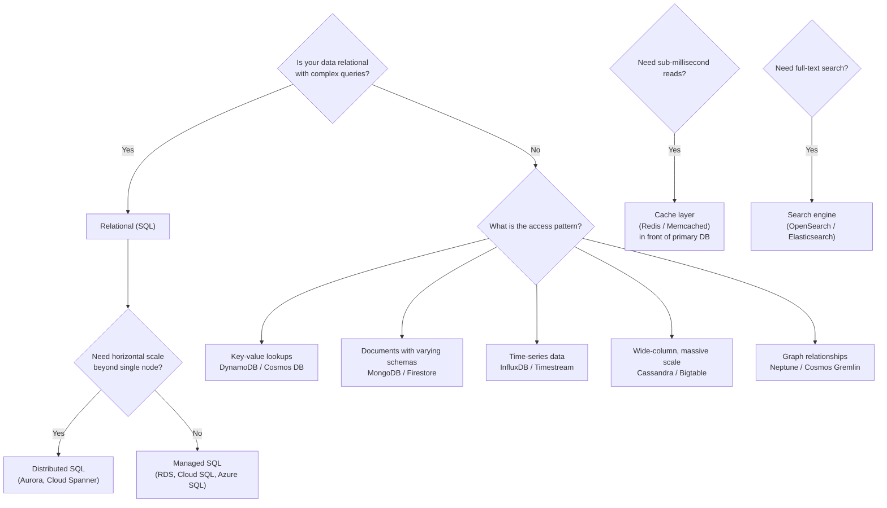

# Databases

## Decision Framework



## Relational (SQL)

Structured data with relationships. ACID transactions. SQL queries. The workhorse.

```yaml
# Managed relational database
database:
  engine: "PostgreSQL"
  version: "15.4"
  instance_size: "db.r6g.large"
  storage:
    type: "SSD"
    size: 500            # GB
    iops: 3000
  high_availability:
    multi_az: true
    backup_retention: 7  # days
  read_replicas: 2       # offload read queries
```

**When relational:** financial transactions, user accounts, order management, any data with strong consistency requirements, complex joins.

## NoSQL

Trade consistency or relational features for scale, flexibility, or performance.

```yaml
# Key-value (DynamoDB)
table:
  name: "user_sessions"
  partition_key: "user_id"
  sort_key: "session_token"
  attributes:
    user_id: "string"
    session_token: "string"
    data: "map"           # flexible schema
  capacity_mode: "on_demand"  # scales automatically
  ttl: 3600              # auto-delete after 1 hour
```

```yaml
# Document store (MongoDB / Firestore)
collection:
  name: "products"
  documents:
    - id: "prod-001"
      name: "Widget"
      price: 29.99
      tags: ["hardware", "popular"]
    - id: "prod-002"
      name: "Gadget"
      price: 49.99
      tags: ["electronics"]
      discount: 0.1       # optional field, different schema
```

**When NoSQL:** high-throughput key lookups, flexible schemas, massive scale (petabytes), session storage, IoT data ingestion, content management.

## Cache

In-memory data store. Sub-millisecond reads. Put it in front of your database.

```yaml
# Redis cache configuration
cache:
  engine: "Redis"
  node_type: "cache.r6g.large"
  replicas: 1
  use_cases:
    - session_storage:
        ttl: 1800
    - query_cache:
        pattern: "cache aside"
        description: "App checks cache first, misses go to DB, result cached"
    - rate_limiting:
        description: "Count requests per user, reject over limit"
```

**When cache:** repeated reads of the same data, session storage, rate limiting, leaderboards, pub/sub messaging.

**Cache invalidation is hard.** Set TTLs. Use cache-aside pattern. Accept eventual consistency. Do not cache data you cannot afford to lose.

## Search

Full-text search, faceted navigation, log analytics.

```yaml
# OpenSearch / Elasticsearch cluster
cluster:
  purpose: "product search and log analytics"
  nodes: 3
  index_pattern:
    - name: "products"
      fields: ["title", "description", "category"]
      analyzer: "standard"
    - name: "logs-*"
      retention: 30       # days
```

## One Database vs Many

Start with one relational database. Add specialized databases only when the general-purpose one cannot meet a specific need. Every additional database adds operational complexity, data consistency challenges, and cost.

```yaml
anti_pattern:
  description: "Using 5 databases on day 1"
  reason: "You don't know your access patterns yet"

pragmatic_approach:
  start: "One SQL database"
  add_cache: "when read latency matters"
  add_search: "when full-text search is needed"
  add_nosql: "when scale exceeds what SQL handles well"
```
