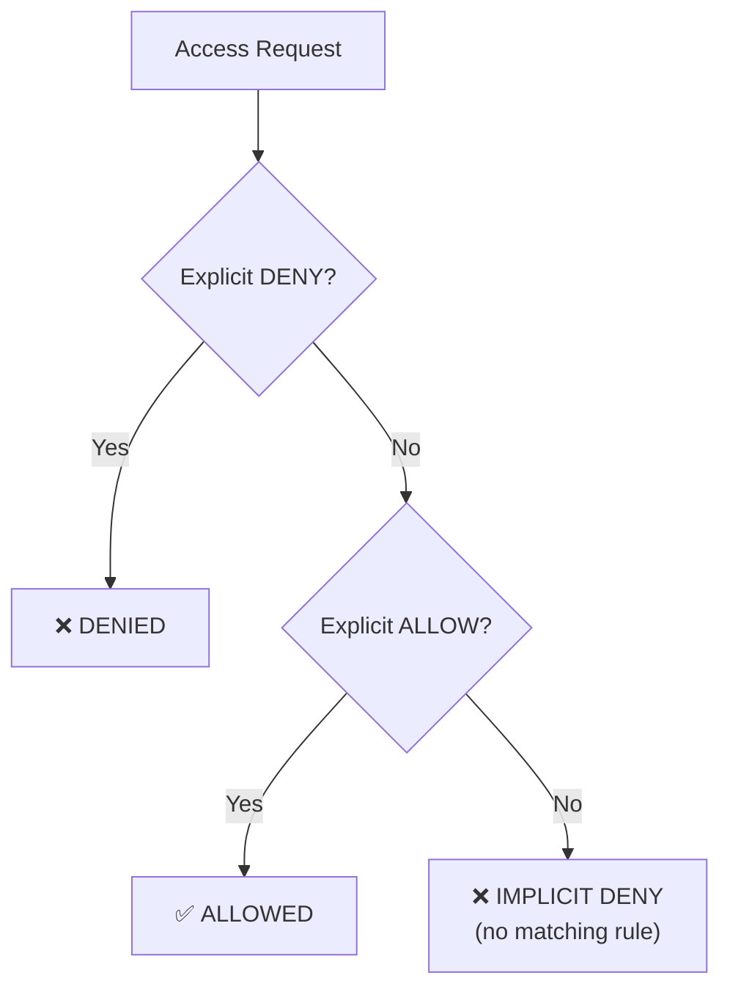
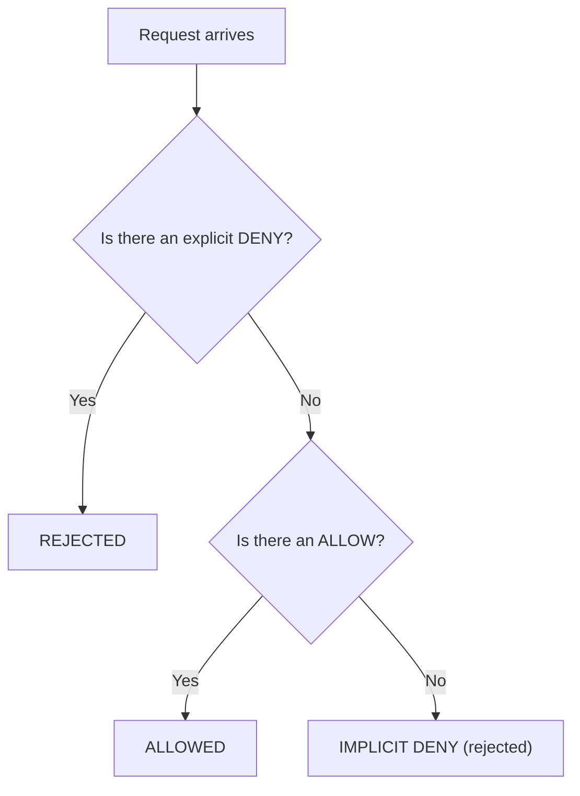

# Identity and Access

## IAM: Who Can Do What

Identity and Access Management is the gatekeeper for every cloud resource. Misconfigure it and everything else falls apart.

```yaml
iam_concepts:
  principal:
    description: "Who is making the request"
    examples: ["User", "Group", "Role", "Service account"]
  action:
    description: "What they want to do"
    examples: ["s3:GetObject", "ec2:StartInstances", "dynamodb:PutItem"]
  resource:
    description: "What they want to do it to"
    examples: ["arn:aws:s3:::my-bucket/*", "arn:aws:ec2:us-east-1:123456:instance/i-abc"]
  effect:
    description: "Allow or deny"
    values: ["Allow", "Deny"]
```

## How Evaluation Works





Default: everything is denied. You must explicitly allow. If any policy denies, it overrides all allows.

## Policies

```yaml
# Example: read-only access to a specific bucket
policy:
  effect: "Allow"
  principal: "role: data-analyst"
  actions:
    - "s3:GetObject"
    - "s3:ListBucket"
  resources:
    - "arn:aws:s3:::analytics-data"
    - "arn:aws:s3:::analytics-data/*"
  conditions:
    - "source_ip: 10.0.0.0/8"        # only from corporate network
    - "aws:MultiFactorAuthPresent: true"  # requires MFA
```

## Roles vs Users

```yaml
# Users: for people
user:
  name: "alice"
  type: "human"
  credentials:
    - password
    - mfa_device
    - access_keys  # for CLI/API access

# Roles: for services and cross-account access
role:
  name: "lambda-execution-role"
  type: "service"
  trusted_entity: "lambda.amazonaws.com"
  description: "Allows Lambda to write logs and read S3"
```

**Rule:** Use roles for services. Use temporary credentials (STS AssumeRole) for cross-account access. Avoid long-lived access keys. Rotate or eliminate them.

## Principle of Least Privilege

Grant the minimum permissions needed to do the job. Nothing more.

```yaml
# Bad: full S3 access
policy:
  effect: "Allow"
  actions: ["s3:*"]
  resources: ["*"]

# Good: specific action on specific bucket
policy:
  effect: "Allow"
  actions: ["s3:GetObject"]
  resources: ["arn:aws:s3:::my-bucket/my-prefix/*"]
```

The bad example lets the principal delete any bucket, read any object, including production data and secrets.

## Why IAM Mistakes Cause Most Breaches

```yaml
common_mistakes:
  - "Wildcard actions (s3:*) on wildcard resources (*)"
  - "Access keys committed to Git"
  - "S3 bucket with public read enabled"
  - "Admin role assigned to every developer"
  - "No MFA requirement for privileged operations"
  - "Service roles with full permissions instead of scoped"
```

The pattern is always the same: overly permissive policy applied broadly, discovered by an attacker scanning for misconfigurations.

## Practical Rules

1. Start with no access. Add permissions as needed.
2. Use groups and roles, never assign policies directly to users.
3. Enable MFA for all human users.
4. Never commit credentials. Use environment variables or secrets manager.
5. Audit permissions quarterly. Remove what is unused.
6. Use IAM Access Analyzer or equivalent to find overly permissive policies.
7. Deny by default. Allow explicitly. Condition when possible.
