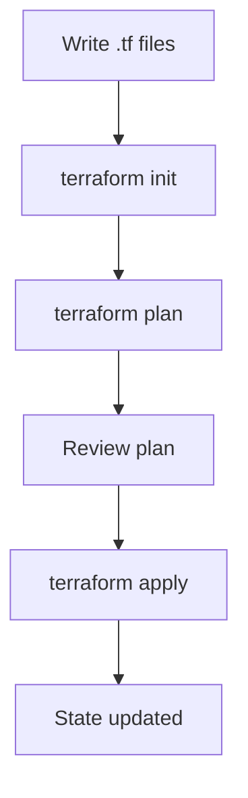

# Terraform Basics

## Core Concepts

```yaml
terraform_concepts:
  provider:
    description: "Plugin that talks to a specific cloud API"
    examples: ["aws", "azurerm", "google"]
  resource:
    description: "An infrastructure object to manage"
    examples: ["aws_instance", "azurerm_storage_account", "google_compute_disk"]
  state:
    description: "Terraform's record of what it created and its current properties"
    location: "Local file (terraform.tfstate) or remote backend"
```

## HCL Syntax

HashiCorp Configuration Language. Declarative: you describe what you want, Terraform figures out how to get there.

```hcl
# Provider configuration
provider "aws" {
  region = "us-east-1"
}

# Resource: an S3 bucket
resource "aws_s3_bucket" "uploads" {
  bucket = "my-app-uploads-prod"

  tags = {
    Environment = "production"
    ManagedBy   = "terraform"
  }
}

# Resource: enable versioning on that bucket
resource "aws_s3_bucket_versioning" "uploads" {
  bucket = aws_s3_bucket.uploads.id

  versioning_configuration {
    status = "Enabled"
  }
}
```

## Step by Step: Create a Bucket

```bash
# 1. Initialize Terraform (downloads providers)
terraform init

# 2. See what Terraform will do (dry run)
terraform plan

# Output:
#   + aws_s3_bucket.uploads  (will be created)
#   + aws_s3_bucket_versioning.uploads  (will be created)

# 3. Apply the changes
terraform apply

# Terraform asks "Do you want to perform these actions?"
# Type "yes"

# 4. Verify
terraform show

# 5. Destroy when done (dev/test only)
terraform destroy
```

## The Workflow



1. **Write .tf files** — define your desired infrastructure
2. **terraform init** — download providers, initialize backend
3. **terraform plan** — compare desired state vs actual state, show diff
4. **Review plan** — READ THE PLAN. Every time.
5. **terraform apply** — execute the plan, update state
6. **State updated** — terraform.tfstate reflects new reality

## State

State maps your resource definitions to real cloud objects. Without state, Terraform cannot know what it already created.

```yaml
# What state contains (simplified)
state:
  resources:
    - type: "aws_s3_bucket"
      name: "uploads"
      provider: "aws"
      attributes:
        id: "my-app-uploads-prod"
        arn: "arn:aws:s3:::my-app-uploads-prod"
        region: "us-east-1"
```

**Rules for state:**
- Never edit state manually. Use `terraform state` commands.
- Never commit state to Git (contains sensitive outputs).
- Use remote state (S3 + DynamoDB, or Terraform Cloud).
- State is the source of truth. Lose it and Terraform loses track of resources.

## Data Sources

Read existing resources that Terraform did not create:

```hcl
# Look up the latest Ubuntu AMI
data "aws_ami" "ubuntu" {
  most_recent = true
  owners      = ["099720109477"]  # Canonical

  filter {
    name   = "name"
    values = ["ubuntu/images/hvm-ssd/ubuntu-jammy-*"]
  }
}

# Use it in a resource
resource "aws_instance" "web" {
  ami = data.aws_ami.ubuntu.id
  # ...
}
```

## Key Takeaway

Terraform reads your `.tf` files, compares them to state, computes a diff, and applies that diff. The cycle is always: write, init, plan, review, apply. Never skip the plan review.
