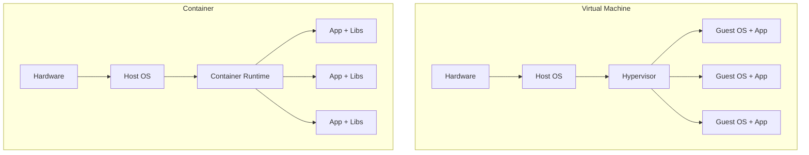
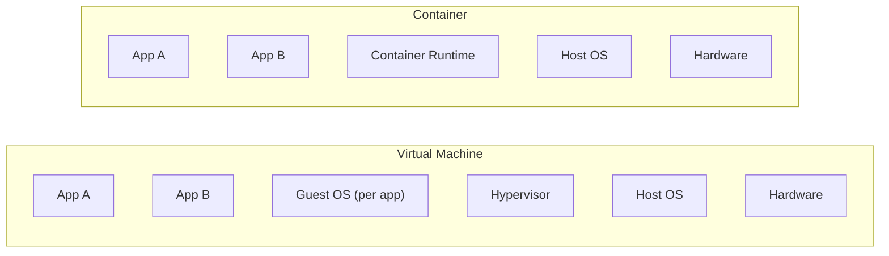

# Containers and Orchestration

## Docker Mental Model

A container is a running process isolated from other processes. It shares the host kernel but has its own filesystem, network, and process space.





A VM virtualizes hardware. A container virtualizes the OS. Containers start in milliseconds, not minutes.

```yaml
# Container image definition (Dockerfile mental model)
image:
  base: "python:3.11-slim"       # minimal OS + Python
  copy: "./app /app"             # your code
  install: "pip install -r requirements.txt"
  expose: 8080
  command: "python server.py"
```

The image is immutable. The same image runs identically on a laptop, a CI server, and a production cluster.

## Why Orchestrate

Running one container is easy. Running 50 across 10 machines is not.

```yaml
problems_without_orchestration:
  - "Which machine has capacity for a new container?"
  - "Container crashed at 3 AM. Who restarts it?"
  - "Need 10 more containers for traffic spike. Manual scaling?"
  - "Deploy new version without downtime. How?"
  - "Container on machine A cannot reach container on machine B."
```

An orchestrator solves these automatically.

## Kubernetes Concepts

```yaml
core_objects:
  pod:
    description: "Smallest unit. One or more containers sharing network/storage"
    analogy: "A running instance of your application"

  deployment:
    description: "Desired state for pods. Manages replicas, updates, rollbacks"
    example: "Run 3 replicas of web-app, update to v2 with rolling deployment"

  service:
    description: "Stable network endpoint for a set of pods"
    example: "web-app-service:8080 routes to any healthy web-app pod"

  namespace:
    description: "Logical cluster within a cluster"
    example: "team-a, team-b, monitoring"
```

```yaml
# Deployment: desired state
deployment:
  name: "web-app"
  replicas: 3
  image: "my-registry/web-app:v2.1.0"
  resources:
    cpu: "500m"          # 0.5 CPU cores
    memory: "256Mi"       # 256 MB
  health_check:
    http_get:
      path: "/health"
      port: 8080
    initial_delay: 5
    period: 10
  update_strategy:
    type: "RollingUpdate"
    max_unavailable: 1
    max_surge: 1
```

## Why Health, Scaling, and Rolling Updates Matter

**Health checks:** The orchestrator pings `/health` every 10 seconds. A pod that fails 3 consecutive checks is killed and replaced. No human intervention.

**Auto-scaling:**
```yaml
auto_scaling:
  min_replicas: 2
  max_replicas: 10
  target_cpu: 70          # scale up when CPU > 70%
  target_memory: 80       # scale up when memory > 80%
  cooldown: 60            # seconds between scaling decisions
```

**Rolling updates:** Deploy v2.1.0 by replacing one pod at a time. If the new version fails health checks, the rollout stops and rolls back. Users never see downtime.

## Managed Kubernetes

Run Kubernetes yourself and you manage the control plane (etcd, API server, scheduler). Use a managed service and the provider handles the control plane. You manage only your applications.

```yaml
managed_options:
  - name: "EKS (AWS)"
  - name: "AKS (Azure)"
  - name: "GKE (GCP)"
```

For most teams, managed Kubernetes is the right choice. Running your own control plane is operational overhead with little benefit.

## When Kubernetes, When Not

```yaml
use_kubernetes:
  - "More than 10-15 services to manage"
  - "Multiple teams sharing infrastructure"
  - "Need advanced deployment strategies (canary, blue-green)"
  - "Complex networking and service discovery requirements"

skip_kubernetes:
  - "One or two services (use ECS, Cloud Run, or App Service)"
  - "Team has no Kubernetes experience and no time to learn"
  - "Simple stateless API (serverless or single container is simpler)"
```

Kubernetes is powerful but complex. Do not adopt it for a 3-service application. The operational cost exceeds the benefit.
