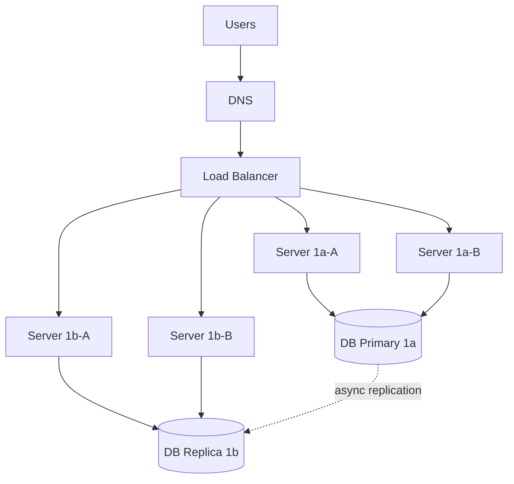

# High Availability

## Designing for Failure

"Everything fails all the time." -- Werner Vogels, Amazon CTO.

High availability means your system continues operating when components fail. Not if. When.

```yaml
availability_targets:
  "99.9%":
    downtime_per_year: "8 hours 45 minutes"
    suitable_for: "Internal tools, dev environments"

  "99.95%":
    downtime_per_year: "4 hours 22 minutes"
    suitable_for: "Business applications"

  "99.99%":
    downtime_per_year: "52 minutes"
    suitable_for: "Customer-facing services"

  "99.999%":
    downtime_per_year: "5 minutes"
    suitable_for: "Life-critical systems, emergency services"
```

Each additional nine costs exponentially more. Do not chase nines you do not need.

## Multi-AZ Architecture

> 🖼️ **[IMAGE_PLACEHOLDER]** — multi-AZ high availability deployment primary replica failover

```yaml
# Single AZ (bad)
single_az:
  app_server: "us-east-1a"
  database: "us-east-1a"
  failure_mode: "AZ outage takes everything offline"

# Multi-AZ (good)
multi_az:
  load_balancer: "spans all AZs"
  app_servers:
    - "us-east-1a (2 instances)"
    - "us-east-1b (2 instances)"
    - "us-east-1c (2 instances)"
  database:
    primary: "us-east-1a"
    replicas:
      - "us-east-1b"
      - "us-east-1c"
    failover: "automatic (typically 30-120 seconds)"
  failure_mode: "One AZ fails, traffic routes to others"
```



## Multi-Region Architecture

> 🖼️ **[IMAGE_PLACEHOLDER]** — active-passive vs active-active multi-region architecture

For global users or disaster recovery. Replicate across geographic regions.

```yaml
# Active-passive (warm standby)
active_passive:
  primary_region: "us-east-1"
  secondary_region: "eu-west-1"
  mode: "All traffic to primary. Secondary is running but idle."
  failover: "DNS switch to secondary. RTO: minutes."
  cost: "Running infrastructure in both regions."

# Active-active
active_active:
  regions: ["us-east-1", "eu-west-1", "ap-northeast-1"]
  mode: "Traffic routed to nearest region via global load balancer"
  database: "Multi-region replication with conflict resolution"
  failover: "Traffic automatically rerouted. No DNS change needed."
  cost: "Significant. Full workload in every region."
  complexity: "High. Data replication and consistency are hard."
```

## RPO and RTO

```yaml
rpo_recovery_point_objective:
  definition: "How much data can you afford to lose?"
  measurement: "Time-based (e.g., RPO = 1 hour means lose at most 1 hour of data)"
  determines: "Backup frequency and replication strategy"

rto_recovery_time_objective:
  definition: "How long can you afford to be down?"
  measurement: "Time-based (e.g., RTO = 15 minutes means back online in 15 min)"
  determines: "Failover mechanism and runbook complexity"

examples:
  - workload: "E-commerce checkout"
    rpo: "0 (synchronous replication)"
    rto: "5 minutes"
    strategy: "Multi-AZ with automatic failover"

  - workload: "Internal reporting"
    rpo: "24 hours"
    rto: "4 hours"
    strategy: "Daily backups, manual restore from backup"

  - workload: "Banking transaction"
    rpo: "0"
    rto: "30 seconds"
    strategy: "Synchronous multi-region replication"
```

## Designing for Failure: Checklist

```yaml
checklist:
  compute:
    - "Multiple instances across AZs"
    - "Auto-scaling to replace failed instances"
    - "Health checks with automatic removal"

  database:
    - "Multi-AZ with automatic failover"
    - "Read replicas for read traffic"
    - "Regular backup testing (restore, not just backup)"

  networking:
    - "Redundant load balancers"
    - "DNS failover to secondary region"
    - "Multiple NAT gateways"

  application:
    - "Circuit breakers for downstream failures"
    - "Graceful degradation (show stale data instead of error)"
    - "Retries with exponential backoff"
    - "Idempotent operations (safe to retry)"
```

## Key Takeaway

Every component fails. Design for it. Multi-AZ for resilience within a region. Multi-region for geographic disaster recovery. Define RPO and RTO to guide architecture. Each additional nine of availability costs more. Choose the right target for the workload.
